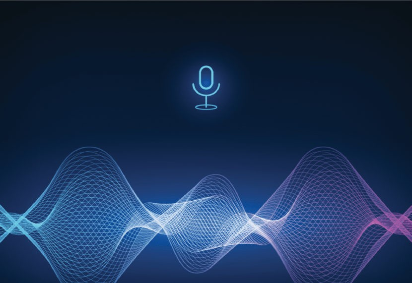

# Speech Processing Labs 🎙️🧠

A collection of Jupyter notebooks covering core topics in speech and natural language processing, including feature extraction, acoustic modeling, deep learning, and modern transformer-based models.

<div align="center">
  
</div>

<br>
<div align="center">
  <a href="https://codeload.github.com/TendoPain18/speech-processing-labs/legacy.zip/main">
    
  </a>
</div>

## 📋 Description

This repository contains lab assignments from a university speech processing course. Each notebook explores a different aspect of speech and NLP — from classical signal processing techniques like MFCC and HMM, to modern deep learning approaches including LSTM, Wav2Vec2, and Whisper fine-tuning.

## 🧪 Labs Overview

### 1. RegEx for Quran Phoneme Transcription (`RegEx_Lab.ipynb`)

Converts Quranic Arabic text into a phoneme representation using Python's `re` module, following the phoneme set and rules defined in a published research paper. Covers Arabic-specific recitation rules (Tajweed) and maps each word to its corresponding phonetic sequence.

**Key concepts:** Regular expressions, Arabic NLP, phoneme mapping, Tajweed rules

---

### 2. MFCC from Scratch (`MFCC__tutorial_44k.ipynb`)

A step-by-step implementation of Mel-Frequency Cepstral Coefficients (MFCC) without relying on high-level library calls. Covers the full pipeline from raw audio at 44.1 kHz through framing, windowing, FFT, mel filterbank construction, and DCT to produce cepstral coefficients.

**Key concepts:** Audio framing, Hann window, FFT, mel scale, filterbank design, DCT

---

### 3. HMM Spoken Digit Recognition (`HMM_Spoken_Digit_Recognition_answers.ipynb`)

Trains a separate Gaussian Mixture Model HMM (GMM-HMM) for each of the ten spoken digits (0–9) using MFCC features extracted from the Free Spoken Digit Dataset. Evaluates recognition accuracy per digit and overall.

**Results:**

| Digit | Accuracy |
|-------|----------|
| 0     | 100.00%  |
| 1     | 100.00%  |
| 2     | 100.00%  |
| 3     | 83.87%   |
| 4     | 100.00%  |
| 5     | 95.35%   |
| 6     | 100.00%  |
| 7     | 96.77%   |
| 8     | 92.31%   |
| 9     | 97.06%   |
| **Overall** | **96.61%** |

**Key concepts:** GMM-HMM (`hmmlearn`), MFCC feature extraction (`librosa`), train/test split, scoring

---

### 4. LSTM Word Prediction (`LSTM.ipynb`)

Builds an LSTM-based language model that predicts the next word in a sequence. Tokenizes a text corpus, creates sliding-window input/output pairs, trains an Embedding + LSTM + Dense network, and generates text from a seed phrase.

**Key concepts:** Keras tokenizer, sequence padding, embedding layer, LSTM, text generation

---

### 5. Fine-Tuning Whisper for Multilingual ASR (`fine_tune_whisper.ipynb`)

Step-by-step guide to fine-tuning OpenAI's Whisper model on a low-resource language from the Common Voice 11.0 dataset using Hugging Face Transformers and the Seq2Seq training API. Includes data preprocessing, feature extraction, WER evaluation, and a Gradio demo.

**Key concepts:** Whisper, Hugging Face Transformers, Common Voice, WER, Seq2SeqTrainer, Gradio

---

### 6. Text-to-Speech with ElevenLabs (`text_to_speech_elevenlabs.ipynb`)

Demonstrates how to use the ElevenLabs API to list available voices and convert Arabic text to speech using the `eleven_multilingual_v2` model. Audio is streamed in chunks and saved as an MP3 file.

**Key concepts:** REST API, ElevenLabs TTS, multilingual synthesis, audio streaming

---

### 7. Arabic Syllable Recognition with Wav2Vec2 (`wav2vec_syllable.ipynb`)

Uses the pretrained `IbrahimSalah/Syllables_final_Large` Wav2Vec2 model with a KenLM language model (`Wav2Vec2ProcessorWithLM`) to transcribe Arabic audio into syllable-level output.

**Key concepts:** Wav2Vec2, CTC decoding, KenLM, pyctcdecode, Arabic speech recognition

---

## 🚀 Getting Started

### Prerequisites

```
Python 3.8+
Jupyter Notebook / Google Colab
```

### Key Dependencies

```bash
pip install librosa hmmlearn transformers datasets soundfile
pip install torch torchaudio tensorflow keras
pip install pyctcdecode requests
pip install https://github.com/kpu/kenlm/archive/master.zip
```

### Running the Notebooks

Clone the repository and open any notebook in Jupyter or Google Colab:

```bash
git clone https://github.com/TendoPain18/speech-processing-labs.git
cd speech-processing-labs
jupyter notebook
```

## 🙏 Acknowledgments

- Course: Speech Processing — Communications and Information Engineering Department
- Datasets: Free Spoken Digit Dataset (Kaggle), Mozilla Common Voice 11.0
- Models: OpenAI Whisper, IbrahimSalah/Syllables_final_Large (Hugging Face)
- ElevenLabs API for TTS synthesis

<br>
<div align="center">
  <a href="https://codeload.github.com/TendoPain18/speech-processing-labs/legacy.zip/main">
    
  </a>
</div>

## <!-- CONTACT -->
<div id="toc" align="center">
  <ul style="list-style: none">
    <summary>
      <h2 align="center">
        🚀
        CONTACT ME
        🚀
      </h2>
    </summary>
  </ul>
</div>
<table align="center" style="width: 100%; max-width: 600px;">
<tr>
  <td style="width: 20%; text-align: center;">
    <a href="https://www.linkedin.com/in/amr-ashraf-86457134a/" target="_blank">
      
    </a>
  </td>
  <td style="width: 20%; text-align: center;">
    <a href="https://github.com/TendoPain18" target="_blank">
      
    </a>
  </td>
  <td style="width: 20%; text-align: center;">
    <a href="mailto:amrgadalla01@gmail.com">
      
    </a>
  </td>
  <td style="width: 20%; text-align: center;">
    <a href="https://www.facebook.com/amr.ashraf.7311/" target="_blank">
      
    </a>
  </td>
  <td style="width: 20%; text-align: center;">
    <a href="https://wa.me/201019702121" target="_blank">
      
    </a>
  </td>
</tr>
</table>
<!-- END CONTACT -->

## **Explore the full spectrum of speech processing — from phonemes to transformers! 🎙️✨**
